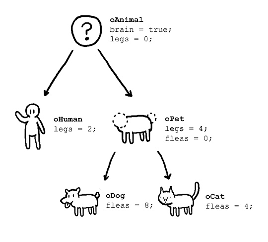

<style>
  :root {
    --color-fg-default: #c9d1d9;
    --color-canvas-default: #0d1117;
  }
</style>

# 객체지향 101

<br/>
<br/>
<br/>
<br/>
<br/>
<br/>
<br/>
<h3 style="text-align: right">숭실대학교 소프트웨어학부 김민준</h3>

---

# 강사 소개

```json
{
    "이름": "김민준",
    "학력": {
        "영훈고등학교": {
            "입학": 2019,
            "졸업": 2022,
            "동아리": {
                "디지털공작반": {"from": 2020, "to": 2022, "spec": "1기부장"},
                "MAKERS": {"from": 2019, "to": 2019}
            }
        },
        "숭실대학교": {
            "전공": "소프트웨어학부",
            "입학": 2022
        }
    }
}
```

---

# 강사 소개

```json
{
    "Github": "Lapis0875",
    "경력": {
        "Python": {
            "year": 4,
            "projects": [
                {"name": "bluearchive"},
                {"name": "D2Wiki"},
                {"name": "proxy-www.py"},
                // ...
            ]
        },
        "Kotlin": {...},
        "Java": {...},
        "C/C++": {...}
    }
}
```

---

# 1. 객체 지향 패러다임이란?

---

# 프로그래밍 패러다임들

<br/>

객체 지향 패러다임은 여러 프로그래밍 패러다임 중 하나에요. 이전 여름 특강때 가볍게 다뤄본 함수형 프로그래밍 또한 마찬가지에요. 객체지향에 대해 알아보기 전에, 이전에 존재해왔던 다른 패러다임들을 가볍게 알아볼게요.

---

# 순차적 (비구조적) 프로그래밍

<br/>

정의한 기능의 흐름에 따라 순서대로 동작을 추가하며 프로그램을 완성하는 방식이에요. 간단한 프로그램의 경우, 코드의 흐름이 직관적으로 보이지만 프로그램의 규모가 조금만 커져도 goto를 활용하는 스파게티 코드가 되어버려요. 이런 문제를 해결하기 위해, 절차적 (구조적) 프로그래밍이 등장했어요.

---

# 절차적 (구조적) 프로그래밍

<br/>

절차적 프로그래밍에서 '절차'는 함수를 의미해여. 즉, 절차적 프로그래밍은 반복되는 동작을 함수 및 프로시저 형태로 모듈화하여 사용하는 방식을 말해요.

> 💡 프로시저란?
> 리턴값이 없는 함수를 말해요.

---

# 절차적 (구조적) 프로그래밍의 단점

구조적 프로그래밍에서는 자료형과 그에 대한 함수를 따로 생각할 수 밖에 없어요. \
자료형과 함수의 선언이 분리되어 있어서, 같은 소스코드 파일 내에 있더라도 이 둘의 연관 여부를 단 번에 알아차리기 어렵기 때문이에요. \
다시 말해, 논리적으로 묶여있을 수 없는 구조이기 때문에 동작이 추상적이에요.

---

# 객체 지향 패러다임이란?

<br/>

객체 지향 프로그래밍은 프로그래밍에서 필요한 데이터들을 추상화를 통해 `상태와 행위를 가진 객체` 로 만들고 각 객체간의 상호작용으로 로직을 작성하는 방법이에요. 절차 지향 프로그래밍이 `무엇을 어떤 절차로 할 것인가?`에 초점을 둔다면, 객체 지향 프로그래밍은 `누가 어떤 일을 할 것인가?`에 초점을 둬요.

---

# 객체지향적 사고

<br/>



---

# 객체지향적 사고

<br/>

- 사람, 개와 고양이 모두 `동물`이라는 추상적인 개념으로 분류됨.
- 2족보행이면 사람, 4족보행이면 `애완동물`이라는 추상적인 개념으로 분류됨.
- 개와 고양이 모두 `애완동물`이라는 추상적인 개념을 구현하지만, 세부 속성은 다름.

<br/>

---

# 객체지향의 요소들

<br/>

- 객체 : 소프트웨어 세계에 구현할 대상(개념)으로, `속성(attribute)`과 `행위(behavior)`를 가져요.
- 클래스 : 추상화를 거쳐 만든 객체의 설계도에요. 객체가 가질 변수와 메서드(함수)로 정의해요.
- 인스턴스 : 객체가 실제로 메모리 상에 할당되어, 실체화 된 것을 의미해요. 보통은 객체와 혼용되어 표기되곤 해요.

---

# 파이썬에서 다뤄보기 1

<br/>

```python
class Book:
    """
    클래스
    """
    def __init__(self, name: str, category: str):
        """
        생성자라고 부르는 특수한 함수에요.
        생성자와 self에 대해서는 다음 차시에 자세히 알아볼게요.
        """
        # 객체가 가지는 속성들이에요.
        self.name: str = name
        self.category: str = category
    
    def info(self):
        """
        객체가 가지는 행위(behavior)이에요.
        """
        print(self.category, ":", self.name)

# 객체가 실제로 구현된, 인스턴스들이에요.
cinderella = Book("신데렐라", "동화")
python_programming = Book("파이썬 프로그래밍", "전공서")
```

<br/>

---

# 파이썬에서 다뤄보기 2

<br/>

```python
class Student:
    """
    클래스
    """
    def __init__(self, name: str, grade: int):
        """
        생성자라고 부르는 특수한 함수에요.
        생성자와 self에 대해서는 다음 차시에 자세히 알아볼게요.
        """
        # ( 1 )
        
    
    def introduce(self):
        """
        학생이 자기소개를 하는 동작이에요.
        """
        # ( 2 )

# 객체가 실제로 구현된, 인스턴스들이에요.
you = ( 3 )
( 4 )   # you 인스턴스가 자기소개를 하게 해요.
```

<br/>

---

# 요약

<br/>

1. 객체지향 프로그래밍
    데이터들을 추상화를 통해 `상태와 행위를 가진 객체` 로 만들고 각 객체간의 상호작용으로 로직을 작성하는 방법
2. 클래스, 객체, 인스턴스
   - 객체 : 소프트웨어 세계에 구현할 대상(개념)으로, `속성(attribute)`과 `행위(behavior)`를 가져요.
   - 클래스 : 추상화를 거쳐 만든 객체의 설계도에요. 객체가 가질 변수와 메서드(함수)로 정의해요.
   - 인스턴스 : 객체가 실제로 메모리 상에 할당되어, 실체화 된 것을 의미해요. 보통은 객체와 혼용되어 표기되곤 해요.

---

# 자료 출처

<br/>

- 6번 슬라이드 객체지향 이미지 출처 : [https://www.reddit.com/r/ProgrammerHumor/comments/418x95/theory_vs_reality/](https://www.reddit.com/r/ProgrammerHumor/comments/418x95/theory_vs_reality/)

---

# 강의를 들어줘서 고마워요 :wink:
